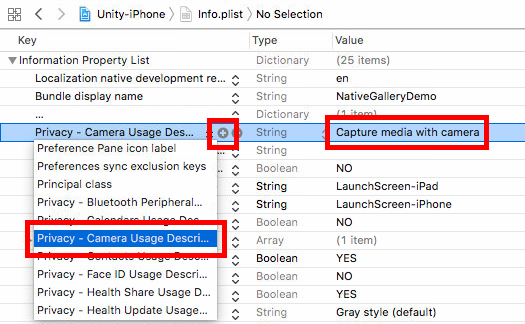
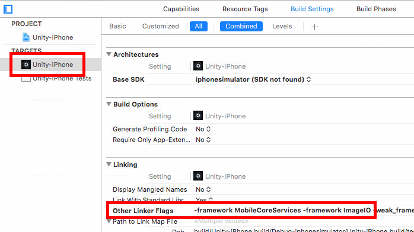

# Unity Native Camera Plugin

**Available on Asset Store:** https://www.assetstore.unity3d.com/en/#!/content/117802

**Forum Thread:** https://forum.unity.com/threads/native-camera-for-android-ios-open-source.529560/

This plugin helps you take pictures/record videos natively with your device's camera on Android and iOS. It has built-in support for runtime permissions, as well.

After importing **NativeCamera.unitypackage** to your project, only a few steps are required to set up the plugin:

### Android Setup

- set **Write Permission** to **External (SDCard)** in **Player Settings**
- NativeCamera requires a small modification in AndroidManifest. If your project does not have an **AndroidManifest.xml** file located at **Assets/Plugins/Android**, you should copy Unity's default AndroidManifest.xml from *C:\Program Files\Unity\Editor\Data\PlaybackEngines\AndroidPlayer* (it might be located in a subfolder, like '*Apk*') to *Assets/Plugins/Android* ([credit](http://answers.unity3d.com/questions/536095/how-to-write-an-androidmanifestxml-combining-diffe.html))
- inside the `<application>...</application>` tag of your AndroidManifest, insert the following code snippet:

```xml
<provider
  android:name="com.yasirkula.unity.NativeCameraContentProvider"
  android:authorities="MY_UNIQUE_AUTHORITY"
  android:exported="false"
  android:grantUriPermissions="true" />
```

Here, you should change **MY_UNIQUE_AUTHORITY** with a **unique string**. That is important because two apps with the same **android:authorities** string in their `<provider>` tag can't be installed on the same device. Just make it something unique, like your bundle identifier, if you like.

To verify this step, you can check the contents of *Temp/StagingArea/AndroidManifest.xml* to see if the *<provider ... />* is still there **after** building your project to Android. 

- (optional) inside the `<manifest>...</manifest>` tag of your AndroidManifest, insert `<uses-feature android:name="android.hardware.camera" android:required="false" />` to declare that your app benefits from camera (if your app requires a camera/can't run without one, then change the value of *android:required* to *true*)

### iOS Setup

There are two ways to set up the plugin on iOS:

#### a. Automated Setup for iOS

- (optional) change the values of **CAMERA_USAGE_DESCRIPTION** and **MICROPHONE_USAGE_DESCRIPTION** in *Plugins/NativeCamera/Editor/NCPostProcessBuild.cs*

#### b. Manual Setup for iOS

- set the value of **ENABLED** to *false* in *NCPostProcessBuild.cs*
- build your project
- enter a **Camera Usage Description** in Xcode



- also enter a **Microphone Usage Description** (see: https://github.com/yasirkula/UnityNativeCamera/issues/2)
- insert `-framework MobileCoreServices -framework ImageIO` to the **Other Linker Flags** of *Unity-iPhone Target*:



## How To

### A. Accessing Camera

`NativeCamera.TakePicture( CameraCallback callback, int maxSize = -1 )`: opens the camera and waits for user to take a picture.
- This operation is **asynchronous**! After user takes a picture or cancels the operation, the **callback** is called (on main thread). **CameraCallback** takes a *string* parameter which stores the path of the captured image, or *null* if the operation is canceled
- **maxSize** determines the maximum size of the returned image in pixels on iOS. A larger image will be down-scaled for better performance. If untouched, its value will be set to *SystemInfo.maxTextureSize*. Has no effect on Android

`NativeCamera.RecordVideo( CameraCallback callback, Quality quality = Quality.Default, int maxDuration = 0, long maxSizeBytes = 0L )`: opens the camera and waits for user to record a video.
- **quality** determines the quality of the recorded video. Available values are: *Default*, *Low*, *Medium*, *High*
- **maxDuration** determines the maximum duration, in seconds, for the recorded video. If untouched, there will be no limit. Please note that the functionality of this parameter depends on whether the device vendor has added this capability to the camera or not. So, this parameter may not have any effect on some devices
- **maxSizeBytes** determines the maximum size, in bytes, for the recorded video. If untouched, there will be no limit. This parameter has no effect on iOS. Please note that the functionality of this parameter depends on whether the device vendor has added this capability to the camera or not. So, this parameter may not have any effect on some devices

`NativeCamera.DeviceHasCamera()`: returns false if the device doesn't have a camera. In this case, TakePicture and RecordVideo functions will not execute.

`NativeCamera.IsCameraBusy()`: returns true if the camera is currently open. In that case, another TakePicture or RecordVideo request will simply be ignored.

Note that TakePicture and RecordVideo functions return a *NativeCamera.Permission* value. More details available below.

### B. Runtime Permissions

Beginning with *6.0 Marshmallow*, Android apps must request runtime permissions before accessing certain services, similar to iOS. There are two functions to handle permissions with this plugin:

`NativeCamera.Permission NativeCamera.CheckPermission()`: checks whether the app has access to camera or not.

**NativeCamera.Permission** is an enum that can take 3 values: 
- **Granted**: we have the permission to access the camera
- **ShouldAsk**: we don't have permission yet, but we can ask the user for permission via *RequestPermission* function (see below). On Android, as long as the user doesn't select "Don't ask again" while denying the permission, ShouldAsk is returned
- **Denied**: we don't have permission and we can't ask the user for permission. In this case, user has to give the permission from Settings. This happens when user denies the permission on iOS (can't request permission again on iOS), when user selects "Don't ask again" while denying the permission on Android or when user is not allowed to give that permission (parental controls etc.)

`NativeCamera.Permission NativeCamera.RequestPermission()`: requests permission to access the camera from the user and returns the result. It is recommended to show a brief explanation before asking the permission so that user understands why the permission is needed and doesn't click Deny or worse, "Don't ask again". Note that TakePicture and RecordVideo functions call RequestPermission internally and execute only if the permission is granted (the result of RequestPermission is then returned).

`NativeCamera.OpenSettings()`: opens the settings for this app, from where the user can manually grant permission in case current permission state is *Permission.Denied* (Android requires *Storage* and, if declared in AndroidManifest, *Camera* permissions; iOS requires *Camera* permission).

`bool NativeCamera.CanOpenSettings()`: on iOS versions prior to 8.0, opening settings from within the app is not possible and in this case, this function returns *false*. Otherwise, it returns *true*.

### C. Utility Functions

`NativeCamera.ImageProperties NativeCamera.GetImageProperties( string imagePath )`: returns an *ImageProperties* instance that holds the width, height, mime type and EXIF orientation information of an image file without creating a *Texture2D* object. Mime type will be *null*, if it can't be determined.

`Texture2D NativeCamera.LoadImageAtPath( string imagePath, int maxSize = -1, bool markTextureNonReadable = true, bool generateMipmaps = true, bool linearColorSpace = false )`: creates a Texture2D from the specified image file in correct orientation and returns it. Returns *null*, if something goes wrong.
- **maxSize** determines the maximum size of the returned Texture2D in pixels. Larger textures will be down-scaled. If untouched, its value will be set to *SystemInfo.maxTextureSize*. It is recommended to set a proper maxSize for better performance
- **markTextureNonReadable** marks the generated texture as non-readable for better memory usage. If you plan to modify the texture later (e.g. *GetPixels*/*SetPixels*), set its value to *false*
- **generateMipmaps** determines whether texture should have mipmaps or not
- **linearColorSpace** determines whether texture should be in linear color space or sRGB color space

## Example Code

The following code has two functions:

- if you click left half of the screen, the camera is opened and after a picture is taken, it is displayed on a temporary cube that is placed in front of the camera
- if you click right half of the screen, the camera is opened and after a video is recorded, it is played using the *Handheld.PlayFullScreenMovie* function

```csharp
void Update()
{
	if( Input.GetMouseButtonDown( 0 ) )
	{
		// Don't attempt to use the camera if it is already open
		if( NativeCamera.IsCameraBusy() )
			return;
			
		if( Input.mousePosition.x < Screen.width / 2 )
		{
			// Take a picture with the camera
			// If the captured image's width and/or height is greater than 512px, down-scale it
			TakePicture( 512 );
		}
		else
		{
			// Record a video with the camera
			RecordVideo();
		}
	}
}

private void TakePicture( int maxSize )
{
	NativeCamera.Permission permission = NativeCamera.TakePicture( ( path ) =>
	{
		Debug.Log( "Image path: " + path );
		if( path != null )
		{
			// Create a Texture2D from the captured image
			Texture2D texture = NativeCamera.LoadImageAtPath( path, maxSize );
			if( texture == null )
			{
				Debug.Log( "Couldn't load texture from " + path );
				return;
			}

			// Assign texture to a temporary cube and destroy it after 5 seconds
			GameObject cube = GameObject.CreatePrimitive( PrimitiveType.Cube );
			cube.transform.position = Camera.main.transform.position + Camera.main.transform.forward * 5f;
			cube.transform.forward = -Camera.main.transform.forward;
			cube.transform.localScale = new Vector3( 1f, texture.height / (float) texture.width, 1f );
			
			Material material = cube.GetComponent<Renderer>().material;
			if( !material.shader.isSupported ) // happens when Standard shader is not included in the build
				material.shader = Shader.Find( "Legacy Shaders/Diffuse" );

			material.mainTexture = texture;
				
			Destroy( cube, 5f );

			// If a procedural texture is not destroyed manually, 
			// it will only be freed after a scene change
			Destroy( texture, 5f );
		}
	}, maxSize );

	Debug.Log( "Permission result: " + permission );
}

private void RecordVideo()
{
	NativeCamera.Permission permission = NativeCamera.RecordVideo( ( path ) =>
	{
		Debug.Log( "Video path: " + path );
		if( path != null )
		{
			// Play the recorded video
			Handheld.PlayFullScreenMovie( "file://" + path );
		}
	} );

	Debug.Log( "Permission result: " + permission );
}
```
